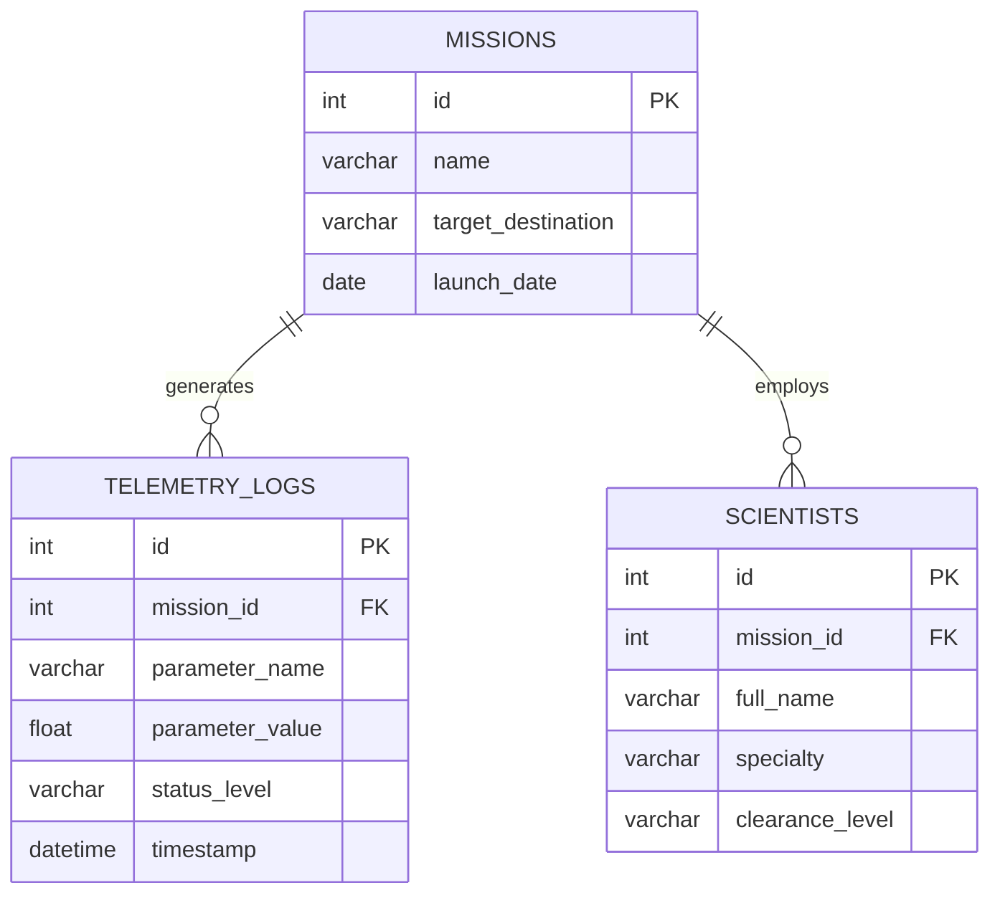
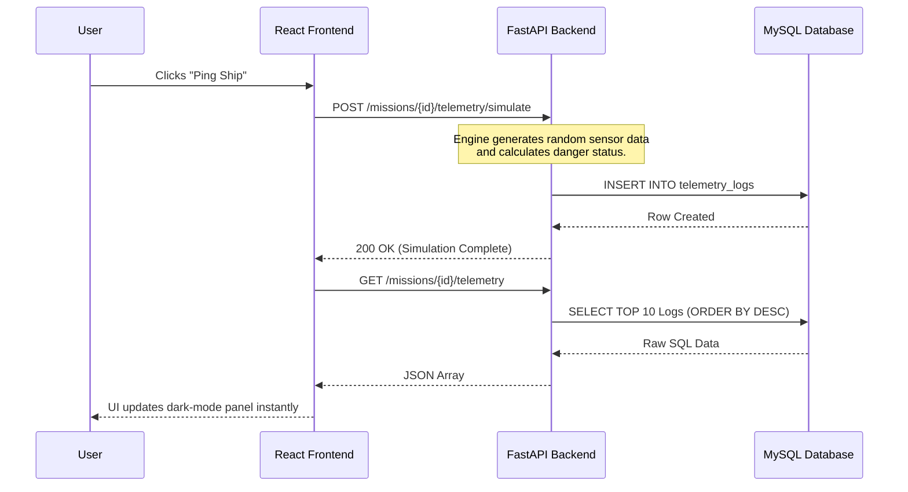

# Space Command Dashboard

A full-stack mission control center built to track spacecraft, manage flight crews, and stream live, simulated telemetry data. This project demonstrates a complete end-to-end architecture, from structuring a secure relational database to building a Python REST API and designing a React interface for real-time state management.

## Tech Stack
* **Frontend:** React.js, Vite, Axios
* **Backend:** Python, FastAPI, Uvicorn
* **Database:** MySQL

## Core Features
* **Live Telemetry Stream:** Simulates real-time sensor readings (Fuel, Velocity, Oxygen), calculates danger levels on the backend, and streams them to a React interface.
* **Mission Control:** Full CRUD functionality to launch new missions, update active targets, and delete aborted flights.
* **Crew Manifest:** Assign scientists and specialists to specific missions, demonstrating complex parent-child database relationships.
* **Data Integrity:** Engineered with strict MySQL relational constraints and robust backend error handling to ensure database stability.

---

## System Architecture & Data Flow

### 1. Database Entity-Relationship Diagram (ERD)
The database enforces strict relational integrity. Both telemetry logs and scientists are tied to active missions via Foreign Key constraints.



### 2. Live Telemetry Data Flow
This sequence demonstrates how the application handles real-time sensor simulation and state updates across different network ports.



---

## Local Setup Instructions

### 1. Database Configuration
1. Ensure MySQL is installed and running locally.
2. Create a new database named `space_exploration`.
3. Execute the SQL commands to create the `missions`, `telemetry_logs`, and `scientists` tables.
4. Update `database.py` with your local MySQL username and password.

### 2. Backend Initialization
1. Open a terminal in the backend directory.
2. Install dependencies: 
   ```bash
   pip install fastapi uvicorn mysql-connector-python pydantic
   ```
3. Start the server: 
   ```bash
   uvicorn main:app --reload
   ```

### 3. Frontend Initialization
1. Open a new terminal in the frontend directory.
2. Install dependencies: 
   ```bash
   npm install
   ```
3. Run the development server: 
   ```bash
   npm run dev
   ```
4. Open the provided localhost URL in your browser.

---
## Contact
**Pradnesh R.**
* Email: pradnesh.r1@gmail.com
* LinkedIn: https://www.linkedin.com/pradnesh-r/