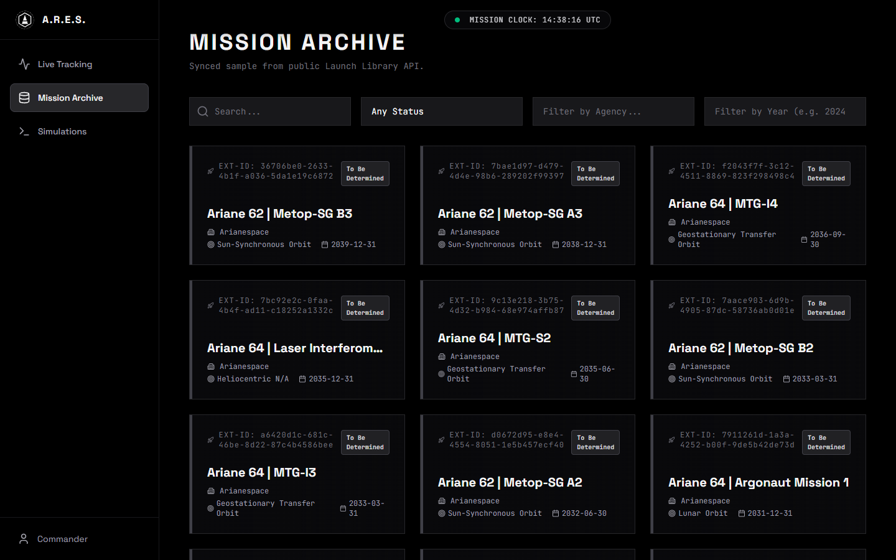
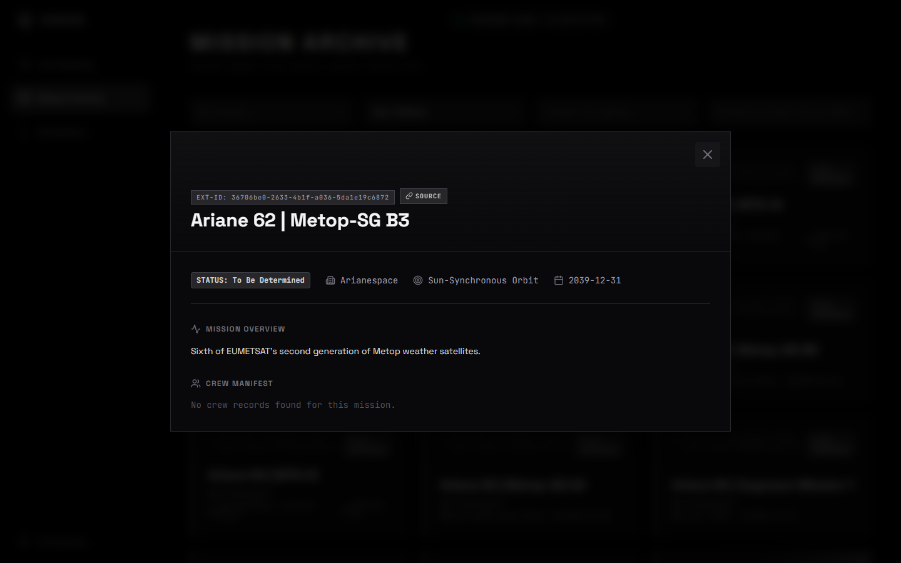

# A.R.E.S. — Autonomous Relay & Exploration System

> A full-stack space exploration platform built to ingest, buffer, and visualize high-frequency satellite telemetry using a dual-tier database architecture, real-time orbital tracking, and Generative AI.


### A.R.E.S. In Action




---

## Table of Contents

- [Why This Project Exists](#why-this-project-exists)
- [Core Features](#core-features)
- [System Architecture](#system-architecture)
- [Architecture & Data Flows](docs/ARCHITECTURE.md)
- [Tech Stack](#tech-stack)
- [Data Flow: Telemetry Ingestion Pipeline](#data-flow-telemetry-ingestion-pipeline)
- [API Reference](#api-reference)
- [Project Structure](#project-structure)
- [Local Installation](#local-installation)
- [What I Learned](#what-i-learned)

---

## Why This Project Exists

Standard web applications rely on direct CRUD operations — a client sends data, the server writes it to a database, done. This model falls apart under the stress of high-frequency data streams like live satellite telemetry, where hundreds of data points arrive per second and a locked relational database becomes the bottleneck.

**A.R.E.S.** was built to solve this problem. Instead of hammering PostgreSQL with rapid inserts, telemetry is captured instantly in an in-memory **Redis** buffer (O(1) writes) and later flushed to **PostgreSQL** via optimized bulk inserts. This dual-tier architecture is the same pattern used in production systems at companies handling real-time data at scale.

Beyond the engineering pipeline, A.R.E.S. is designed as an **all-in-one space exploration hub** — a platform where users can browse a realistic searchable sample of historical and active missions, track live satellites in real-time on an interactive map, and leverage AI to generate diagnostic reports from raw orbital mechanics.

---

## Engineering Summary

If you are exploring this repository to understand its technical foundations, keep the following core engineering concepts in mind:

- *"A.R.E.S. is a FastAPI and React full-stack telemetry system."*
- *"The core engineering problem it solves is high-frequency database writes."*
- *"Instead of bottlenecking a relational database, Redis absorbs data bursts in memory, then FastAPI bulk-flushes the records to Postgres."*
- *"The Mission Archive is a public-facing dataset backed by real synced Launch Library data."*
- *"Admin-only endpoints protect mutations and the telemetry flushing pipeline, using JWT."*

---

## Core Features

### 🗂️ Mission Archive
A comprehensive database of space missions — populated via an external sync with the public Launch Library API. This provides a realistic sample of historical and active space missions. Missions are linked to agencies, spacecraft, and crew members through a fully relational schema with proper foreign key constraints and cascade rules.

- Full CRUD operations (Create, Read, Update, Delete)
- Search and filter by name, agency, status, or destination
- Crew manifest management with role assignments
- Agency and spacecraft registry

### 📡 Live Satellite Tracking
Real-time orbital tracking powered by the [Where The ISS At](https://wheretheiss.at/) API with a 15-second circuit-breaker and simulated failsafe — the dashboard never goes down, even if the external API collapses.

- Live ISS position, altitude, velocity, and coordinates
- Interactive world map with satellite positions and orbit visualization
- Fault-tolerant polling with automatic fallback to simulated telemetry
- Extensible architecture for tracking additional satellites via N2YO API

### 🧠 AI Flight Director
A Generative AI module powered by **Google Gemini Flash Lite** that translates raw orbital mechanics into human-readable diagnostic briefs. Responses are cached in Redis for 15 minutes to minimize redundant API calls.

- Analyzes live telemetry (altitude, velocity, coordinates)
- Generates actionable 2-paragraph diagnostic briefs in Markdown
- Returns status classification (NOMINAL / WARNING)
- Publicly accessible endpoint with response caching and IP-based rate limiting to control Gemini usage

### ⚡ High-Frequency Ingestion Pipeline
The engineering centerpiece — a Redis-backed telemetry buffer that decouples data ingestion from database writes.

- **Stream**: Simulated high-frequency telemetry payloads (modeling real sensors) are pushed to a Redis list (`telemetry_buffer`) in O(1) time.
- **Buffer**: Data accumulates in memory without touching the relational database. An API endpoint monitors queue length.
- **Flush**: Admin triggers a batched write. Records are read from Redis, bulk-inserted into PostgreSQL, then trimmed from the buffer.
- **Why**: This architectural pattern demonstrates how to prevent database lock contention under high write loads, proving the system's viability for genuine scale.

### 🔐 Secure Commander Access
Role-based access control using OAuth2 and JWT (JSON Web Tokens). Public users can browse missions, view live data, and request cached/rate-limited AI analysis. Only authenticated commanders can modify data or trigger telemetry buffer flushes.

- OAuth2 password flow with JWT bearer tokens
- 2-hour token expiry with automatic re-authentication
- Protected routes enforce admin role verification
- Credential management via environment variables

---

## System Architecture

For a detailed breakdown of the request flow, authentication, telemetry buffering, and AI rate-limiting, see the **[Architecture & Data Flows Documentation](docs/ARCHITECTURE.md)**.

```
┌─────────────────────────────────────────────────────────────┐
│                     FRONTEND (React 19 + Vite)              │
│                                                             │
│  Landing ──── Mission Archive ──── Live Tracking ──── Sims  │
│     │              │                    │              │     │
│     └──────────────┴────────────────────┴──────────────┘     │
│                           │ Axios                            │
├───────────────────────────┼──────────────────────────────────┤
│                     BACKEND (FastAPI)                        │
│                           │                                  │
│  ┌─────────┐  ┌───────────┼───────────┐  ┌───────────────┐  │
│  │  Auth   │  │    API Router Layer    │  │   Services    │  │
│  │  (JWT)  │  │                       │  │  Redis Client │  │
│  │         │  │  /archive  /live      │  │  Gemini Client│  │
│  │         │  │  /simulation /login   │  │               │  │
│  └─────────┘  └───────────┼───────────┘  └───────┬───────┘  │
│                           │                      │           │
├───────────────────────────┼──────────────────────┼───────────┤
│                    DATA LAYER                    │           │
│                           │                      │           │
│              ┌────────────┴──────────┐    ┌──────┴────────┐  │
│              │   PostgreSQL 15       │    │   Redis 7     │  │
│              │   (Persistent Store)  │    │   (In-Memory  │  │
│              │                       │    │    Buffer +   │  │
│              │   missions            │    │    AI Cache)  │  │
│              │   scientists          │    │               │  │
│              │   agencies            │    │  telemetry_   │  │
│              │   spacecrafts         │    │    buffer     │  │
│              │   telemetry_logs      │    │  mission:iss: │  │
│              │   mission_results     │    │    ai_report  │  │
│              └───────────────────────┘    └───────────────┘  │
│                                                              │
│  Entire stack containerized via Docker Compose (frontend,    │
│  backend, postgres, redis)                                   │
└──────────────────────────────────────────────────────────────┘
                           │
                    External APIs
                           │
              ┌────────────┴──────────────┐
              │  Where The ISS At API     │
              │  (Live orbital data)      │
              ├───────────────────────────┤
              │  Google Gemini Flash Lite │
              │  (AI diagnostic reports)  │
              └───────────────────────────┘
```

---

## Tech Stack

| Layer | Technology | Purpose |
|-------|-----------|---------|
| **Frontend** | React 19 (Vite) | Component-based UI with hot module replacement |
| **Styling** | Tailwind CSS v4 | Utility-first CSS framework |
| **State Management** | React state + effects | Lightweight client state for the current dashboard scope |
| **HTTP Client** | Axios | Request interceptors for JWT auth injection |
| **Mapping** | react-globe.gl / Three.js | Interactive 3D orbital tracking visualization |
| **Backend** | Python + FastAPI | Async-capable REST API with automatic OpenAPI docs |
| **ORM** | SQLAlchemy | Relational mapping with relationship cascades |
| **Validation** | Pydantic v2 | Request/response schema validation |
| **Auth** | PyJWT + OAuth2 | Bearer token authentication flow |
| **AI** | Google Gemini via GenAI SDK | Natural language telemetry analysis |
| **Database** | PostgreSQL 15 | Persistent relational storage with indexing |
| **Cache** | Redis 7 | In-memory telemetry buffer + AI response cache |
| **Infrastructure** | Docker Compose | Zero-config container orchestration |

---

## Data Flow: Telemetry Ingestion Pipeline

This is the engineering pattern that separates A.R.E.S. from standard CRUD applications:

```
Step 1: STREAM                Step 2: BUFFER              Step 3: FLUSH
─────────────────           ─────────────────          ─────────────────
Client sends                Redis stores in            Admin triggers
POST /telemetry/stream      in-memory list             POST /telemetry/flush
        │                         │                          │
        ▼                         ▼                          ▼
   ┌─────────┐              ┌──────────┐              ┌──────────┐
   │ FastAPI  │──rpush()──▶ │  Redis   │──lrange()──▶ │ FastAPI  │
   │ receives │   O(1)      │  Buffer  │  + ltrim()   │ reads &  │
   │ payload  │             │          │              │ clears   │
   └─────────┘              └──────────┘              └────┬─────┘
                                                           │
                                                    bulk_insert_mappings()
                                                           │
                                                           ▼
                                                    ┌──────────┐
                                                    │ Postgres │
                                                    │ (perm.   │
                                                    │  storage)│
                                                    └──────────┘
```

**Why not write directly to PostgreSQL?**
Under high-frequency ingestion (hundreds of writes/second), PostgreSQL acquires row-level locks for each INSERT, creating contention. Redis handles O(1) list appends without locking, then bulk inserts batch the data into a single database transaction — reducing lock time from N operations to 1.

---

## API Reference

### Public Routes (No Auth Required)

| Method | Endpoint | Description |
|--------|----------|-------------|
| `GET` | `/` | API health check |
| `GET` | `/test-db` | PostgreSQL connection test |
| `GET` | `/missions` | List all missions (supports `search`, `status`, `agency`, `year` filters) |
| `GET` | `/missions/{id}` | Get mission by ID |
| `GET` | `/missions/{id}/telemetry` | Get last 10 telemetry readings |
| `GET` | `/missions/{id}/crew` | Get crew manifest |
| `GET` | `/agencies` | List all space agencies |
| `GET` | `/spacecrafts` | List all registered spacecraft |
| `GET` | `/live/iss/telemetry` | Fetch live ISS position (with failsafe) |
| `POST` | `/live/iss/analyze` | Generate public AI diagnostic report via Gemini cache/rate limit |

### Protected Routes (JWT Bearer Token Required)

| Method | Endpoint | Description |
|--------|----------|-------------|
| `POST` | `/login` | Authenticate and receive JWT token |
| `POST` | `/missions` | Create a new mission |
| `PUT` | `/missions/{id}` | Update mission parameters |
| `DELETE` | `/missions/{id}` | Terminate (delete) a mission |
| `POST` | `/missions/{id}/crew` | Assign crew member to mission |
| `POST` | `/agencies` | Register a new space agency |
| `POST` | `/spacecraft` | Register a new spacecraft |
| `POST` | `/telemetry/stream` | Push telemetry payload to Redis buffer |
| `POST` | `/telemetry/flush` | Flush Redis buffer to PostgreSQL |

---

## Project Structure

```
ARES-Telemetry-System/
├── docker-compose.yml          # PostgreSQL 15 + Redis 7 containers
├── README.md
│
├── backend/
│   ├── main.py                 # App entry — FastAPI setup, CORS, router wiring
│   ├── services.py             # Shared clients (Redis, Gemini AI)
│   ├── database.py             # SQLAlchemy engine and session factory
│   ├── models.py               # ORM models (Mission, Scientist, Agency, etc.)
│   ├── auth.py                 # JWT token generation and verification
│   ├── import_missions.py      # Script to sync real data from Launch Library API
│   ├── requirements.txt
│   ├── .env.example            # Environment variable template
│   └── routes/
│       ├── archive.py          # Mission CRUD, crew, agencies, spacecraft
│       ├── live.py             # ISS tracking + AI Flight Director
│       └── simulation.py       # Telemetry stream (Redis) + flush (PostgreSQL)
│
└── frontend/
    ├── index.html
    ├── package.json
    ├── vite.config.js
    └── src/
        ├── main.jsx            # React entry point
        ├── App.jsx             # Root component and routing
        ├── index.css           # Tailwind imports + custom theme
        └── components/         # UI components
```

---

## Local Installation

### Prerequisites
- [Docker Desktop](https://www.docker.com/products/docker-desktop) (for PostgreSQL + Redis)
- [Node.js 18+](https://nodejs.org/)
- [Python 3.10+](https://www.python.org/downloads/)
- [Google Gemini API Key](https://aistudio.google.com/apikey)

### 1. Clone & Configure

```bash
git clone https://github.com/UnknownArk/ARES-Telemetry-System.git
cd ARES-Telemetry-System
```

Create `backend/.env` from the template:

```bash
cp backend/.env.example backend/.env
```

Edit `backend/.env` and add your Gemini API key:

```env
DB_PASSWORD=ares_password
ADMIN_USERNAME=commander
ADMIN_PASSWORD=deepspace
SECRET_KEY=your_secret_key_here
GEMINI_API_KEY=your_actual_api_key
```

### 2. Start the Stack

```bash
docker compose up -d --build
```

This spins up the entire architecture:
- PostgreSQL 15 on port `5432`
- Redis 7 on port `6379`
- FastAPI Backend on port `8000`
- Vite/React Frontend on port `80` (accessible via Nginx)

### 3. Sync Mission Data (Optional)

```bash
docker compose exec backend python import_missions.py
```

Injects a synced sample (up to 150 missions) from the public Launch Library archive into the Postgres database.

*(Note: If you ever need to reset the database and clear all records, you can wipe the Docker volumes by running `docker compose down -v` and then restarting the stack).*

### 4. Access the Application

- **Dashboard**: Live at `http://localhost`
- **API Docs**: Live at `http://localhost:8000/docs`

---

## What I Learned

Building A.R.E.S. taught me patterns that go beyond typical tutorial projects:

- **Write-heavy system design**: Why direct database writes fail under load, and how in-memory buffers (Redis) solve the problem with O(1) amortized writes and batched flushes.
- **Fault-tolerant API integration**: Designing a circuit-breaker pattern with fallback responses so the dashboard stays operational even when external APIs go down.
- **JWT authentication flow**: Implementing OAuth2 password flow with bearer tokens, protected route dependencies, and token expiry handling.
- **AI prompt engineering**: Crafting specific, structured prompts for Gemini to produce consistent, actionable output — not generic chatbot responses.
- **Separation of concerns**: Refactoring a monolithic 350-line file into modular FastAPI routers with shared services and clean dependency injection.
- **Dual-tier data architecture**: Understanding when to use Redis (speed, volatility) vs PostgreSQL (durability, relationships) and how they complement each other.

---

## Current Limits

To maintain a focused and highly performant demonstration, the system deliberately accepts the following constraints:
- **Mission Sync**: The archive sync is capped to 150 records for demo speed.
- **Live Tracking**: Real-time orbital visualization currently focuses specifically on the ISS.
- **Deployment**: The Docker deployment is designed as a local-first environment.
- **AI Analytics**: AI diagnostic reports depend on the external Google Gemini API availability.

---

## Roadmap / Future Enhancements

- **[Issue #1] Add Alembic migrations for schema evolution**: Implement database migrations so the schema can be upgraded seamlessly without dropping tables.
- **[Issue #2] Code-split frontend globe bundle**: Optimize the initial React load time by lazy-loading the heavy Three.js / Globe visualization components.
- **[Issue #3] Extend live tracking beyond ISS**: Integrate N2YO or similar APIs to track additional active satellites in orbit.

---

## Contact

**Pradnesh R.**
- Email: pradnesh.r1@gmail.com
- LinkedIn: [linkedin.com/in/pradnesh-r](https://www.linkedin.com/in/pradnesh-r/)
- GitHub: [github.com/UnknownArk](https://github.com/UnknownArk)

---

*Built as a demonstration of high-throughput system design, fault-tolerant API integration, and production-grade application architecture.*
